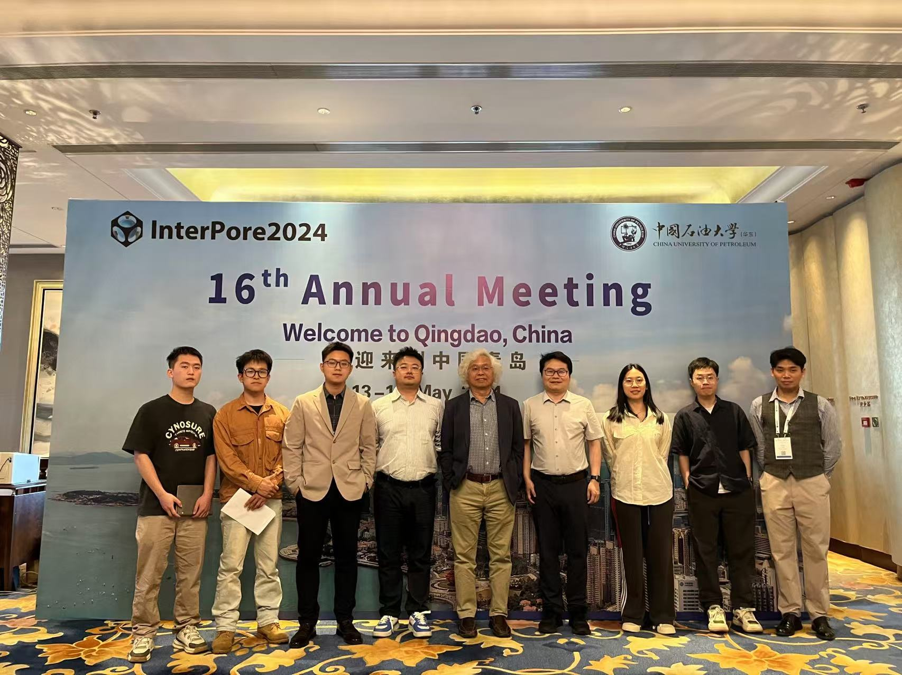

* I am currently a graduate student in the College of Civil Engineering at Hunan University, supervised by [Prof. Chao Zhang](https://www.researchgate.net/profile/Chao-Zhang-43). I joined Prof. Zhang's [UNSAT lab](https://chaozhanghnu.github.io) in 2021 as a 3-rd year undergraduate student, and completed my B.S. degree in 2020 at the same institution.

* My passion lies in comprehending the diverse and intriguing **phase equilibrium and transition processes of water** in porous media (also include water droplets), and unraveling their implications on the behaviour of frozen porous materials. I am try to integrate cutting-edge insights from **surface and interfacial science**, **nucleation theory**, and **soil-water interaction theory**, while utilizing advanced **microscopic experiments** (e.g., microfluidic chip, synchrotron X-ray wide-angle/small-angle scattering, infrared spectroscopy, high-speed photography, etc.) to delve into the physics mechanisms underlying **water freezing and melting, ice propagation dynamics, and water flow in frozen soil**. Additionally, my research also involves modeling thermal-hydraulic-mechanical processes, such as permafrost degradation and landslides, in cold regions against the backdrop of global climate change.
  
* If you are interested in my research, please feel free to contact me via email [xin_lin@hnu.edu.cn](mailto:xin_lin@hnu.edu.cn) ([17561652702@163.com](mailto:17561652702@163.com)) or Wechat: LX824KBLove
  

News
======
**Test (11/2024):** I pass the IELTS test with 7.0 overall (Listening 7.5, Reading 7.5, Writing 6.5, Speaking 5.5).

**Conference(05/24):** I attenend the _InterPore Annual Meeting_ at Qingdao and presented a poster.

**Paper(02/24):** Our paper titled ["Heterogeneous ice nucleation of salt solution in porous media"](https://doi.org/10.1063/5.0190862) was published in _The Journal of Chemical Physics_.

**Experiment(12/23):** I conducted WAXS and SAXS field experiments at _Shanghai Synchrotron Radiation Facility_ at Shanghai.

**Conference(7/23):** I attended _the 11th Annual Academic Conference of Shanghai Synchrotron Radiation Facility_ at Yantai.

  <button onclick="prevImage()" class="gallery-button gallery-button-prev"></button>
  
  <button onclick="nextImage()" class="gallery-button gallery-button-next"></button>

