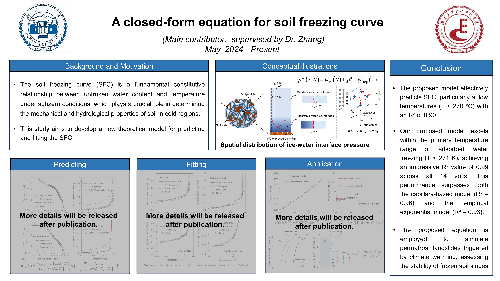



Education and Qualifications
======
* **Master in Civil Engineering ([ARWU Top 15 Academic Subjects Worldwide](https://www.shanghairanking.com/rankings/gras/2023/RS0211)), Hunan University**,
   Sep. 2022 - Present

  Core-curriculum: Advanced Soil Mechanics, Dynamics of Structure, Rock and Soil Dynamics.
  
* **B.S. in Civil Engineering ([ARWU Top 15 Academic Subjects Worldwide](https://www.shanghairanking.com/rankings/gras/2023/RS0211)), Hunan University**,
  Sep. 2018 - Jun. 2022

  Core-curriculum:  Fluid Mechanics, Soil Mechanics, Structural Mechanics, Advanced Mathematics, Theory of Elasticity, Mechanics of Materials.

  GPA: **3.67/4.00**.          Ranking: **3/51**.

Research Interests
======
Water Phase Transitions and Equilibriums in Porous Media; Freezing Behavior of Water Droplets; Unsaturated Soils Mechanics. 

Publications
======
[1] **Lin, X.**, Zhang, C.*, Hu, S. Chen, R. ["Heterogeneous ice nucleation of salt solution in porous media"](https://doi.org/10.1063/5.0190862) _The Journal of Chemical Physics_, 2024. DOI:10.1063/5.0190862

[2] Zhang, C.* **Lin X**, Zhao, N, Hu, S. Salts retard ice crystal growth in supercooled droplets during recalescence. _Physical Review Fluid_, under review

[3] **Lin X**, Zhang, C.*, Lu N. A closed-form equation for soil freezing curve. To be submited to _Journal of Geotechnical and Geoenvironmental Engineering_, in preparation

[4] **Lin X**, Zhang, C.* Structural evolution of ice crystals and soil pores during cooling: Scanning synchrotron small-and wide-angle X-ray scattering studies, in preparation.

* *Supervisor.

Research Experience: 
======
* **A theoretical model for soil freezing curve** (Taking the Lead, May 2024 - Present).

  

  
 
  

* **Ice crystal propagation in supercooled salty droplets** (Taking the Lead, Sept. 2023 - Sept. 2024).

  

  
 

* **Heterogeneous ice nucleation of salt solution in porous media** (Taking the Lead, Oct. 2022 - Oct. 2023).

  

  
  

* **Structural evolution of ice crystals in soils: Scanning synchrotron WAXC/SAXS studies** (Taking the Lead, Dec. 2023 - Present).

* **Infrared Spectroscopy for Detecting Water/water Structure and Content in Soil** (Participating in, Jan. 2024 ~ Present).

* **Regulating cascading freezing by water nanofilm thickness** (Participating in, Jun. 2021 - Feb. 2023)
  
  

  
  

Selected Honors and Awards
======
* Outstanding Undergraduate Graduates of Hunan University, Hunan University, May 2022.

* Chinese National Inspirational Scholarship, Ministry of Education of the People’s Republic of China, December 2020, 2021

* First Class Scholarship of Hunan University, Hunan University, November 2019, 2022, 2023, 2024

* Haofen Scholarship of Hunan University, Hunan University, October 2020,2021

* Merit Student of Hunan University, Hunan University, November 2019, 2020.

Skills
======
* Knowledge
  * Nucleation theory; Crystal growth theory; Water potential theory; Soil-water interaction mechanism; Unsaturated soil mechanics.
* Experiment skills
  * Cryostage for freezing experiments; High-speed photography; Wide-angle and small-angle X-ray scattering (WAXS/SAXS) tests; Infrared spectroscopy; Differential 
    scanning calorimetry (DSC); Microfluidic chips
* Software & Tools
  * Matlab; Comsol; PDFgetX3; Fit2D; Python

  
