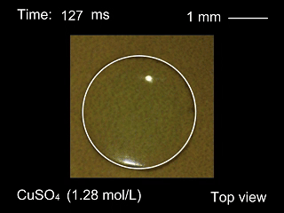
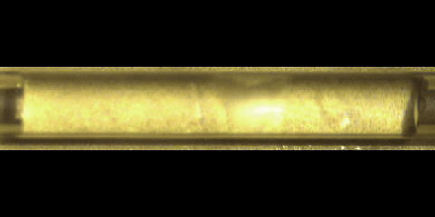
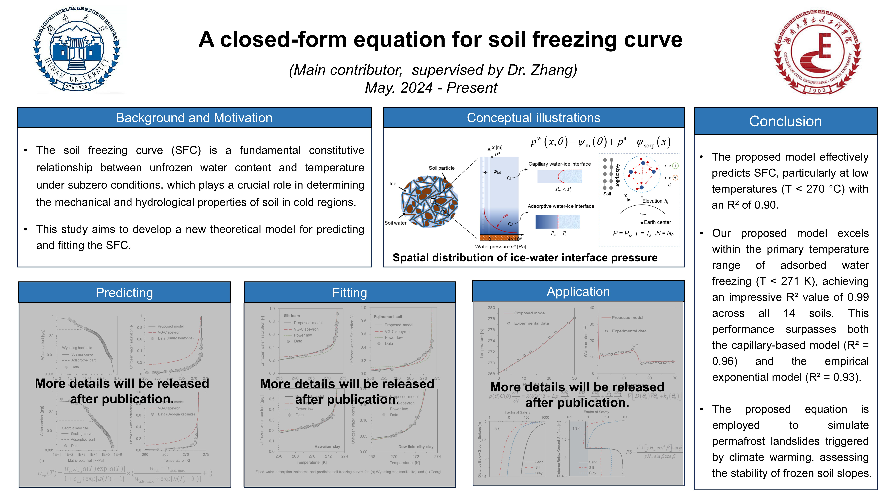
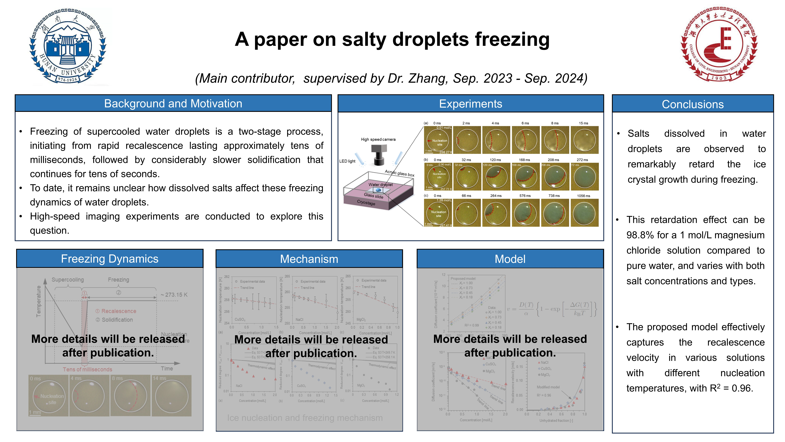
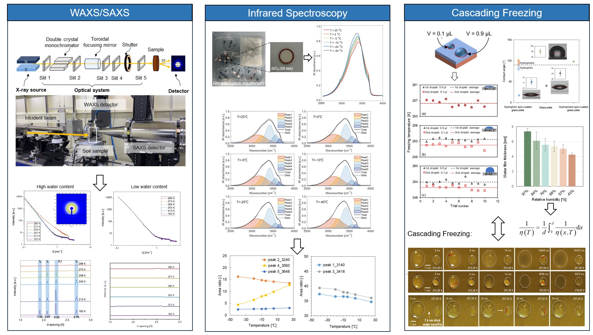



Education and Qualifications:
======
* **Master in Civil Engineering ([ARWU Top 15 Academic Subjects Worldwide](https://www.shanghairanking.com/rankings/gras/2023/RS0211)), Hunan University**,
   Sep. 2022 - Present

  Core-curriculum: Advanced Soil Mechanics, Dynamics of Structure, Rock and Soil Dynamics.
  
* **B.S. in Civil Engineering ([ARWU Top 15 Academic Subjects Worldwide](https://www.shanghairanking.com/rankings/gras/2023/RS0211)), Hunan University**,
  Sep. 2018 - Jun. 2022

  Core-curriculum:  Fluid Mechanics, Soil Mechanics, Structural Mechanics, Advanced Mathematics, Theory of Elasticity, Mechanics of Materials.

  GPA: **3.62/4.00**.          Ranking: **3/51**.

Research Interests
======
Water Phase Transitions and Equilibriums in Porous Media; Freezing Behavior of Water Droplets; Unsaturated Soils Mechanics. 

    
    
    

Publications
======
[1] **Lin, X.**, Zhang, C.*, Hu, S. Chen, R. ["Heterogeneous ice nucleation of salt solution in porous media"](https://doi.org/10.1063/5.0190862) _The Journal of Chemical Physics_, 2024. DOI:10.1063/5.0190862

[2]  Zhang C., Zhao N., Hu S., and **Lin X.**, Salts Retard Ice Crystal Growth in Supercooled Droplets during Recalescence. Under review.

[3]  Zhang C., **Lin X.**, Hu S., and Lu N., Predicting Soil Freezing Curve via a Modified Clapeyron Equation. Under review.

[4]  A paper on structural evolution of ice crystals and soil pores via WAXS/SAXS. in preparation.

Research Experience: 
======
* **A theoretical model for soil freezing curve** (Taking the Lead, May 2024 - Present):
  * **Theoretical model:** We have proposed a new physical model to determine the fundamental constitutive relationship between unfrozen 
    water content and temperature under subzero conditions, grounded in the thermodynamics of phase equilibrium and soil water interaction 
    mechanisms.
  * **Application:** The constitutive relationship is incorporated into the COMSOL to compute and assess the stability of one-dimensional 
    seasonally frozen soil landslides.

  

  
 
  

* **Ice crystal propagation in supercooled salty droplets** (Taking the Lead, Sept. 2023 - Sept. 2024).
  * **Reduction in ice crystal growth:** Salts dissolved in water droplets markedly retard ice crystal growth , with the effect being up to 98.8% 
    for a 1 mol/L magnesium chloride solution compared to pure water, varying with salt concentrations and types.
  * **Proposed model:** The classical Wilson-Frenkel model is modified to capture the freezing behavior of the  droplet with varying with salt concentrations and types.

  

  
 

* **Heterogeneous ice nucleation of salt solution in porous media** (Taking the Lead, Oct. 2022 - Oct. 2023).
   * **Physical mechanism for freezing temperature depression:** Heterogeneous ice nucleation (HIN) is identified as the primaily mechanism for freezing of pore solution, as evidenced by the observation that the freezing temperature decreases with the decreasing solid–liquid interfacial areas, regardless of pore diameter and pore solution volume.  
   * **Classical nucleation theory (CNT) for freezing:** We have proposed a modified CNT model for the freezing behavior of pore solutions, demonstrating excellent performance in capturing experimental data across various pore solution concentrations, achieving high R-values exceeding 0.92 for all salts.

  

   
  

* **Structural evolution of ice crystals in soils: Scanning synchrotron WAXC/SAXS studies** (Taking the Lead, Dec. 2023 - Present).
   * **High-energy particle scattering experiments:** We have conducted wide-angle and small-angle X-ray scattering in _Shanghai Synchrotron Radiation Facility_ to investigate ice structure and pore structure in variably saturated soils.
   * **High-energy particle scattering experiments:** Two distinct forms of ice in clay soils, hexagonal Ih and cubic Ic, are identified using WAXS, while changes in pore structure are simultaneously measured down to the nanoscale (~ 2 nm) via SAXS.

* **Others**: Infrared Spectroscopy, Differential Scanning Calorimetry, Microfluidic Chip technology, Cryostage for freezing experiments, etc.
  
<!--

  

-->
  

Selected Honors and Awards: 
======
* Outstanding Undergraduate Graduates of Hunan University, Hunan University, May 2022.

* Chinese National Inspirational Scholarship, Ministry of Education of the People’s Republic of China, December 2020, 2021

* First Class Scholarship of Hunan University, Hunan University, November 2019, 2022, 2023, 2024

* Haofen Scholarship of Hunan University, Hunan University, October 2020,2021

* Merit Student of Hunan University, Hunan University, November 2019, 2020.

Skills
======
* Knowledge
  * Nucleation theory; Crystal growth theory; Water potential theory; Soil-water interaction mechanism; Unsaturated soil mechanics.
* Experiment skills
  * Cryostage for freezing experiments; High-speed photography; Wide-angle and small-angle X-ray scattering (WAXS/SAXS) tests; Infrared spectroscopy; Differential 
    scanning calorimetry (DSC); Microfluidic chips
* Software & Tools
  * Matlab; COMSOL - Software for Multiphysics Simulation; PDFgetX3; Fit2D; Python

  
